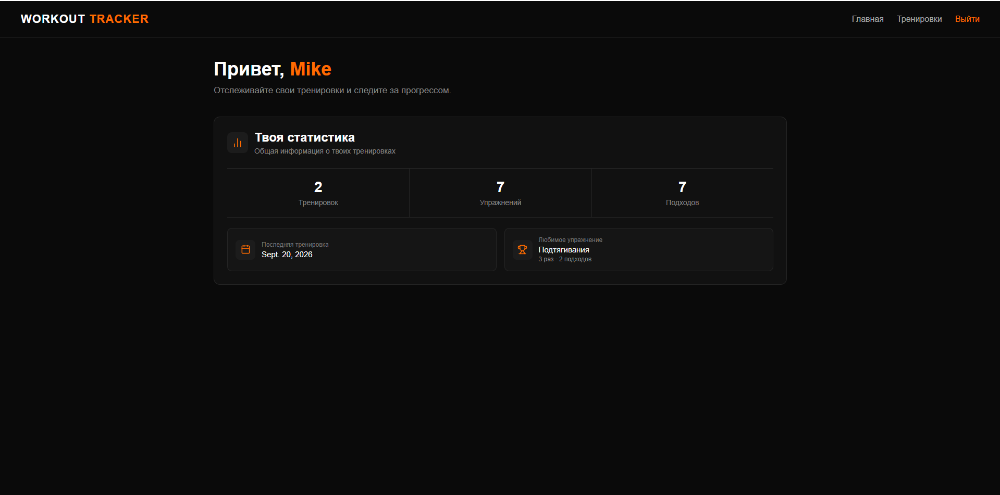
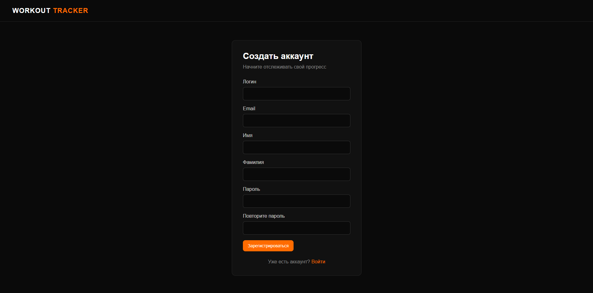
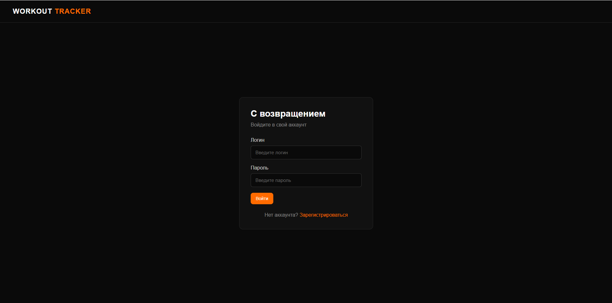
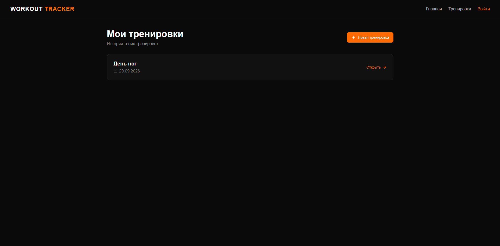
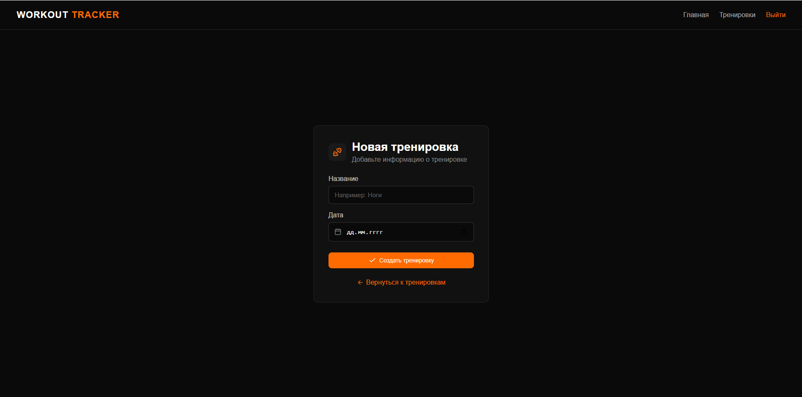
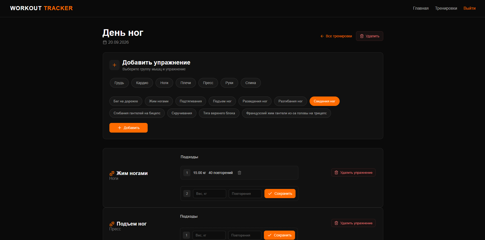

# Workout Tracker
### pet-project

**Workout Tracker** — это веб-приложение для отслеживания тренировок и прогресса пользователя. Приложение позволяет создавать тренировки, добавлять упражнения и сохранять результаты отдельных подходов: вес, количество повторений и дистанцию для кардио.

Проект разработан в учебных целях для изучения Python, Django, работы с базой данных и создания веб-приложений.

## Основные возможности

- **Регистрация и авторизация пользователей**
- **Создание тренировок с указанием названия и даты**
- **Добавление упражнений в тренировку**
- **Фильтрация упражнений по группам мышц**
- **Сохранение результатов подходов**
- **Запись веса и количества повторений**
- **Удаление упражнений и отдельных подходов**
- **Просмотр истории тренировок пользователя**

## Стек технологий

- **Backend:**
  - Python
  - Django

- **Frontend:**
  - HTML
  - CSS
  - JavaScript
  - Lucide Icons

- **База данных:**
  - SQLite

## Архитектура

- **Веб-интерфейс пользователя:** доступ через браузер.
- **Серверная часть:** реализована с использованием Django.
- **Система хранения и обработки данных:** SQLite.
- **Аутентификация:** используется встроенная система авторизации Django.

## Структура данных

В приложении используются следующие основные сущности:

- **Пользователь** — учетная запись пользователя.
- **Группа мышц** — категория, к которой относится упражнение.
- **Упражнение** — доступное пользователю упражнение.
- **Тренировка** — отдельная тренировка пользователя.
- **Упражнение в тренировке** — связь между тренировкой и упражнением.
- **Подход** — результат выполнения упражнения с указанием веса, повторений или дистанции.

## Пользовательские интерфейсы

В Workout Tracker реализованы следующие страницы и элементы навигации:

| Интерфейс | Описание | Пример скриншота |
|---|---|---|
| **Главная страница** | Основная страница приложения после авторизации |  |
| **Регистрация** | Создание нового аккаунта пользователя |  |
| **Авторизация** | Вход пользователя в приложение |  |
| **Тренировки** | Просмотр списка созданных тренировок |  |
| **Создание тренировки** | Создание новой тренировки с указанием названия и даты |  |
| **Упражнения** | Просмотр упражнений тренировки, добавление упражнений и сохранение подходов |  |
